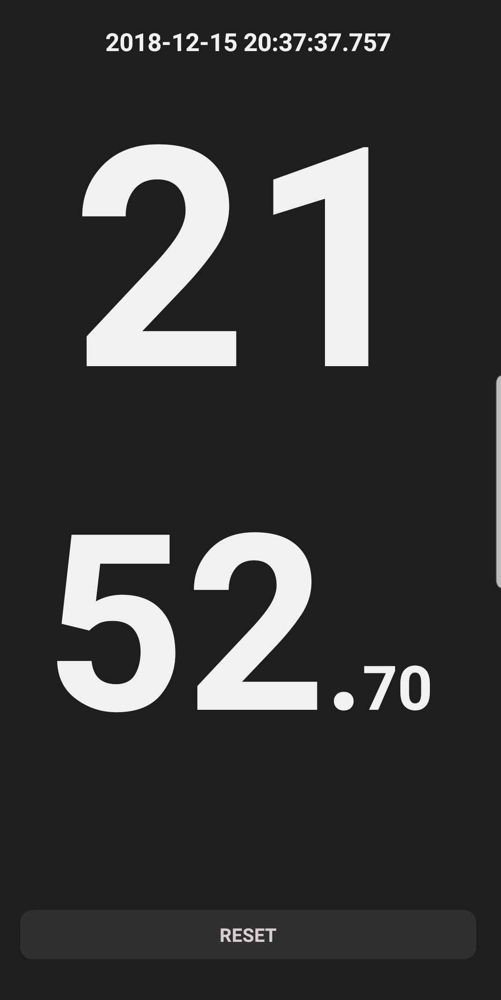

# GymStopWatch
> 健身房秒表，分秒展示很醒目

目前一般的计时器、秒表应用对于在健身房锻炼这个场景来说，数字太小不容易看得清。

尤其是一边举铁，一边需要关注时长、组间时间。

### 使用方法

双击屏幕开始\暂停计时

点击屏幕底部按钮重置计时

运行截图

### 感谢

1. 参考计时器相关代码[SuStopwatch](https://github.com/sufadi/SuStopwatch)

2. 分钟部分切换效果[数字切换效果ticker](https://github.com/robinhood/ticker)